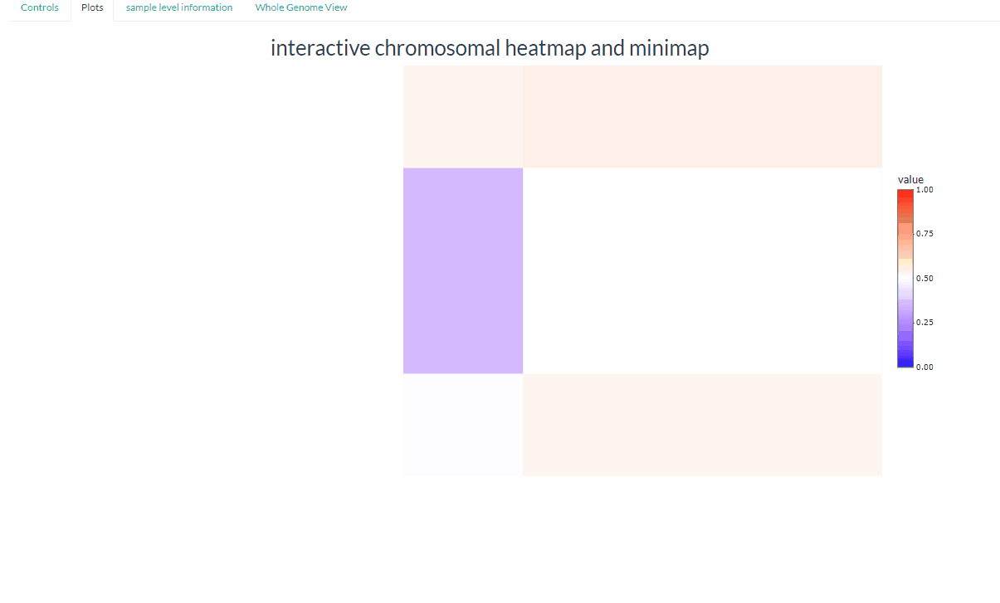
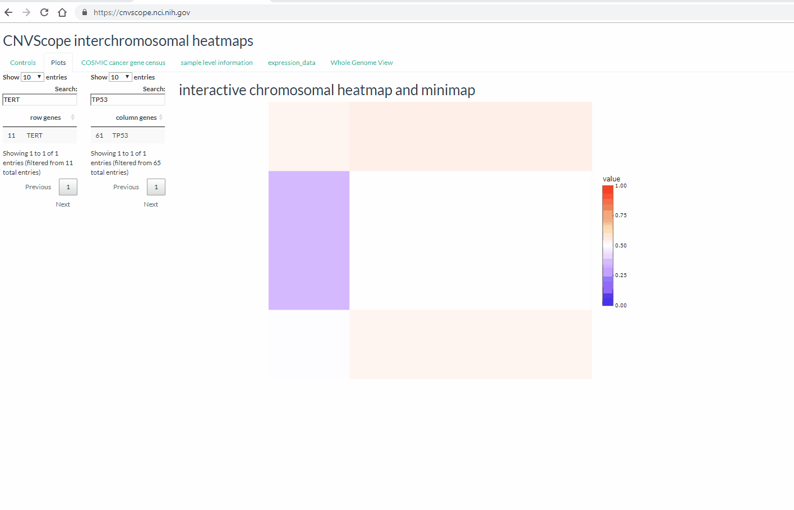

```{r setup, include=FALSE}
knitr::opts_chunk$set(echo = TRUE)
```
CNVScope is a visualization toolkit for seeing copy number data in a relationship fashion,
both utilizing tools that find regions of interest (much like domains in Hi-C terminology),
visualize the relationships in vibrant color (blue for negative association, red for positive), and integrates several different relevant types of data (RNASeq, sample information, Cancer Gene Census data, and structural variants). Structural variants like rearrangements can be thought of as interactions between genomic regions, which is why it makes sense to build  GenomicInteractions objects and from this, interaction matrices that can be easily visualized.

#Installation
To install, it is best to install the github version (this is the most updated) and the CNVScopePublicData package (the data package is fairly large, so be patient while it installs). The next line will have you up and running!
```{r echo=T, eval=F}
remotes::install_github("jamesdalg/CNVScope")
CNVScope::runCNVScopeLocal()
```

#App

The app includes several components and starts with a customizable control panel. As an example, we'll search for TERT and TP53.


Doing it this way creates a zoomed in plot of the copy number relationships between the chromosomes containing TERT (chromosome 5) and TP53 (chromosome 17), zoomed into the specific region for those particular genes (as denoted in the search box). For many regions, we can rely on the tooltip for genes, but this region is particularly gene dense and it's best to simply click on the region of interest. The row and column genes are searchable here and will aid us to understand that we're in the right place.


Clicking on the cancer gene census tab will lead us to the genes that are found within the cancer gene census, (a curated list of cancer genes)[https://cancer.sanger.ac.uk/census]. Corresponding info suggests what cancers associated with the gene, mechanism of action (if known), and tissue types.

The sample level information will lead us to a series of plots (histogram, scatter, a colored linear regression plot) that will get at the underlying data behind the negative log p-value, and help us detect outliers, look at clusterings of samples, and see if the regression p-value is driven by a variety of points from different cancer types rather than just an outlier or a group of outliers. All the plots are zoomable and a slider for opacity has been provided for the histogram to more clearly see distributions that might tightly overlap.

Expression data is provided for neuroblastoma, sorting the most variable genes to the top for the specific set of chromosomal regions for the clicked point.

Finally, a whole genome view is provided to give the viewer a sense of the complexity and domains of the neuroblastoma interactome and to encourage further exploration of subpoints. The slider allows the user to select the saturation limit and thereby see domains that otherwise would be invisible due to the high values on the diagonal.




#Package

The package focuses on methods of analyzing these matrices and constructing components for app use. See the following vignettes for more information (also available on command line):

[Creating the Input matrix from public data](https://cran.r-project.org/web/packages/CNVScope/vignettes/create_input_matrix.html)

[Linear Regression/Postprocess](https://cran.r-project.org/web/packages/CNVScope/vignettes/create_output_matrix.html)

#Video Tutorial

For a complete video tutorial (12 minutes in length), [click here](cnvscope_tutorial.mp4).