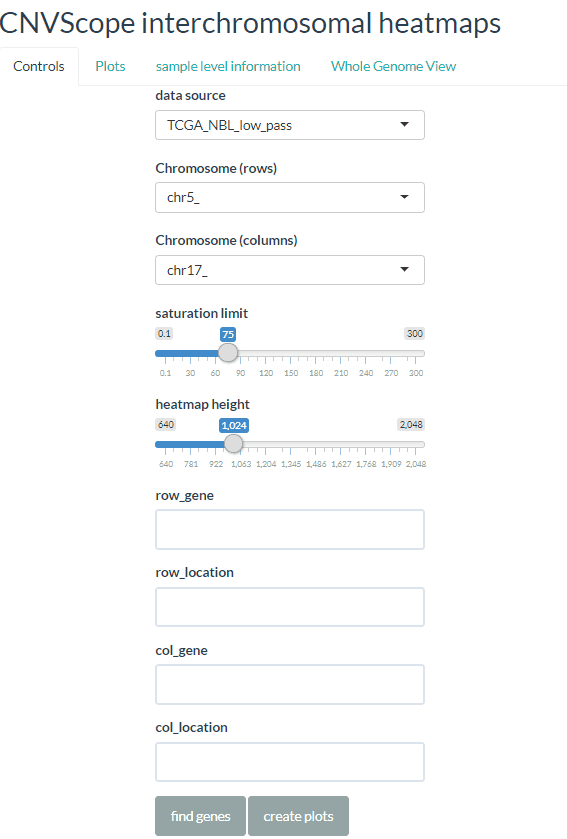

CNVScope
================
James Dalgleish
January 13, 2021


NOTE: cnvscope.nci.nih.gov still does function, but the digicert certificate has expired. The complex process of getting this approved through my institute takes time, but in the meantime, feel free to ignore the warnings and "proceed anyway" with chrome or use a different browser that will let you through.

-   [Installation](#installation)
-   [App](#app)
-   [Package](#package)
-   [Video Tutorial](#video-tutorial)
-   [Additional Examples](#additional-examples)


CNVScope is a visualization toolkit for seeing copy number data in a
relationship fashion, both utilizing tools that find regions of interest
(much like domains in Hi-C terminology), visualize the relationships in
vibrant color (blue for negative association, red for positive), and
integrates several different relevant types of data (RNASeq, sample
information, Cancer Gene Census data, and structural variants).
Structural variants like rearrangements can be thought of as
interactions between genomic regions, which is why it makes sense to
build GenomicInteractions objects and from this, interaction matrices
that can be easily visualized.

Installation
============

The package is intended for users with experience in the R programming language.
Non-R users should use the public site:
http://cnvscope.nci.nih.gov


The program should install using the following code:
``` r
install.packages("CNVScope")
```
To install the development version (may have more features), please use:
``` r
remotes::install_github("jamesdalg/CNVScope")
CNVScope::runCNVScopeLocal()
```
For those having difficulty, we provide more detailed instructions below:

Installation works best if base R and R tools are up to date.
1. install R directly from the Comprehensive R Archive Network (CRAN):
https://cran.r-project.org/index.html
Windows:https://cran.r-project.org/bin/windows/base/
Macintosh: https://cran.r-project.org/bin/macosx/
2. Install RStudio. If running macintosh, install Xcode when prompted.
3. Install the appropriate compilation tools for your operating system:
a. For windows, please download & install the latest version of RTools:
https://cran.r-project.org/bin/windows/Rtools/
b. For macintosh, be sure to install the latest version of gfortran and clang (make sure these install AFTER Xcode, so that it overwrites the existing clang installation):
https://cran.r-project.org/bin/macosx/tools/
4. Install Bioconductor Dependencies, set allowed repositories, and install the package:
Run the following on the R command line:
``` r
install.packages("BiocManager")
BiocManager::install(c("DNAcopy","GenomeInfoDb","BSgenome.Hsapiens.UCSC.hg19"))
setRepositories(ind=c(1:2))
install.packages("CNVScope")
```

The package is now installed and should contain the vignettes, functions, and help files.

5. To install the app data (several GB), use the following lines:
``` r
install.packages("remotes")
CNVScope::runCNVScopeLocal()
```

Please wait for the package to finish downloading. It is a large package that contains all
of the Neuroblastoma Data and may take some time.
In the meantime, feel free to browse our public server:
https://cnvscope.nci.nih.gov

App
===

The app includes several components and starts with a customizable
control panel. As an example, we’ll search for TERT and TP53.


Doing it this way creates a zoomed in plot of the copy number
relationships between the chromosomes containing TERT (chromosome 5) and
TP53 (chromosome 17), zoomed into the specific region for those
particular genes (as denoted in the search box). For many regions, we
can rely on the tooltip for genes, but this region is particularly gene
dense and it’s best to simply click on the region of interest. The row
and column genes are searchable here and will aid us to understand that
we’re in the right place. 

Clicking on the cancer gene census tab will lead us to the genes that
are found within the cancer gene census, (a curated list of cancer
genes)\[<https://cancer.sanger.ac.uk/census>\]. Corresponding info
suggests what cancers associated with the gene, mechanism of action (if
known), and tissue types.

The sample level information will lead us to a series of plots
(histogram, scatter, a colored linear regression plot) that will get at
the underlying data behind the negative log p-value, and help us detect
outliers, look at clusterings of samples, and see if the regression
p-value is driven by a variety of points from different cancer types
rather than just an outlier or a group of outliers. All the plots are
zoomable and a slider for opacity has been provided for the histogram to
more clearly see distributions that might tightly overlap.

Expression data is provided for neuroblastoma, sorting the most variable
genes to the top for the specific set of chromosomal regions for the
clicked point.

Finally, a whole genome view is provided to give the viewer a sense of
the complexity and domains of the neuroblastoma interactome and to
encourage further exploration of subpoints. The slider allows the user
to select the saturation limit and thereby see domains that otherwise
would be invisible due to the high values on the diagonal.


Package
===

The package focuses on methods of analyzing these matrices and
constructing components for app use. See the following vignettes for
more information (also available on command line):

[Creating the Input matrix from public
data](https://cran.r-project.org/web/packages/CNVScope/vignettes/create_input_matrix.html)

[Linear
Regression/Postprocess](https://cran.r-project.org/web/packages/CNVScope/vignettes/create_output_matrix.html)

Video Tutorial
===


For a complete video tutorial (16 minutes in length), [click
here](cnvscope_tutorial.mp4).

Additional Examples
===


Feel free to look at the additional examples vignette. We have several
GDC datasets that demonstrate that our package is a versatile toolkit
that is useful for NBL, as well as SKCM (Skin Cancer), BLCA (bladder
cancer), AML (Acute Myleoid Leukemia), and PRAD (Prostate Cancer). We
also demonstrate our copy number relationship weighting function as well
as contour and 3D representations. The final example, of BLCA chr17, is
shown below. [Click here to download an interactive HTML
version.](./blca3d.html)


