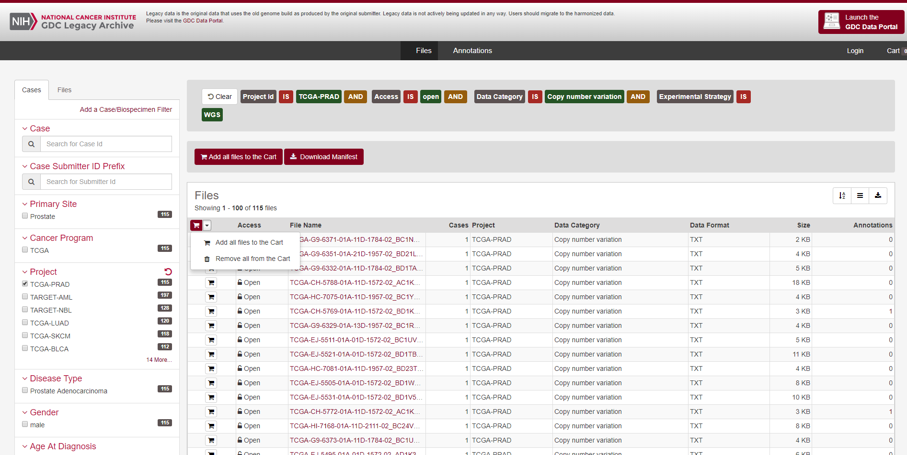
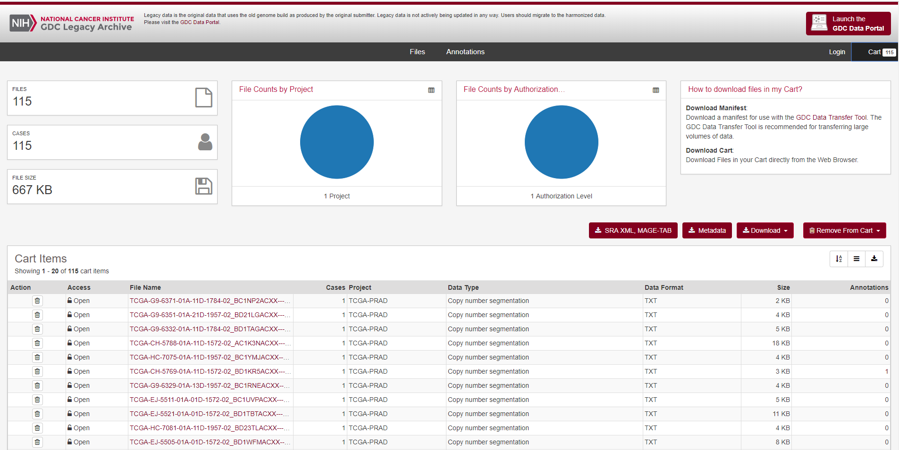

<style>
  .main-container {
    max-width: 1200px !important;
  }
</style>
<style type="text/css">
.main-container {
  max-width: 1200px;
  margin-left: auto;
  margin-right: auto;
}
</style>
---
title: "Creating Prostate Cancer Input Matrices from public GDC (TCGA) data"
author: "James Dalgleish"
date: "January 12, 2019"
output: rmarkdown::html_vignette
vignette: >
 %\VignetteEngine{knitr::rmarkdown}
 %\VignetteIndexEntry{Creating the TCGA Input matrix from public data}
 %\VignetteEncoding{UTF-8}
---
```{r setup, include=FALSE}
knitr::opts_chunk$set(echo = TRUE)

knitr::opts_knit$set(root.dir = '.')
library(CNVScope)
```
We have to begin our work by loading the library:
```{r,eval=F,echo=T}
library(CNVScope)
```
Following this, we'll obtain TCGA copy number data from the GDC archive.

 Users can download the tar.gz file and remove the tsv files into a single folder. We have already done that here.
The source for these files is located at the NCI Genomic Data Commons (TCGA-PRAD, copy number variation, WGS, open access)


The user simply chooses to add all the files to the cart, then click the black cart button in the top right hand corner.



On the cart page, click download, then cart. It will be downloaded as a tar.gz archive.

You can untar it with R, but the files will be in a complex set of directories. It is best to list the files recursively
with criteria that will obtain the segment files in tsv format, with that single comparison of interest.
```{r,eval=F,echo=T}
if(!dir.exists("extracted_prad_data")){dir.create("extracted_prad_data")
untar("gdc_download_prad.tar.gz",exdir = "extracted_prad_data")}
tcga_files_prad<-list.files(path = "extracted_prad_data",pattern=glob2rx("*.tsv"),recursive=T,full.names = T)
print(tcga_files_prad)

```
With the full list of input files from the GDC, these can then be simply loaded into a function that will read all of them, sample match them, and aggregate the data into a bin-sample matrix. This matrix can then be saved into the fast, space efficient, RDS filetype.
```{r,eval=F,echo=T}
sample_aggregated_segvals_output_full_prad<-formSampleMatrixFromRawGDCData(tcga_files = tcga_files_prad,format = "TCGA",binsize=1e6)
saveRDS(sample_aggregated_segvals_output_full_prad,"PRAD_sample_matched_input_matrix.rds")

```
