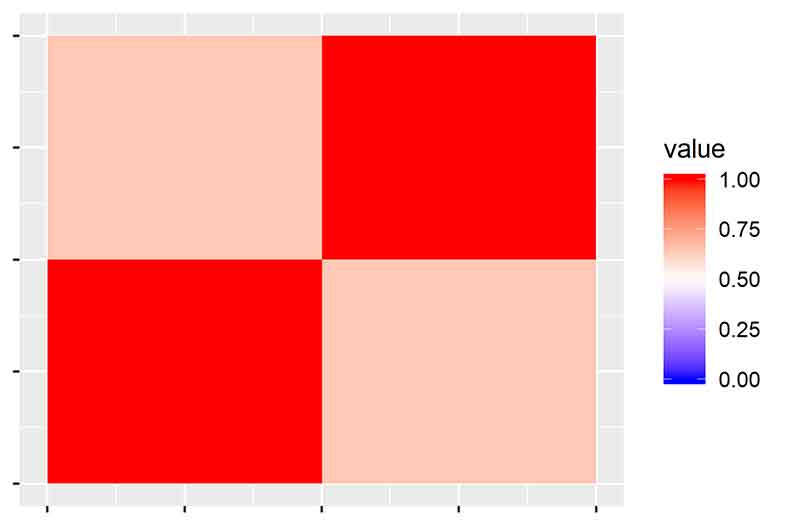
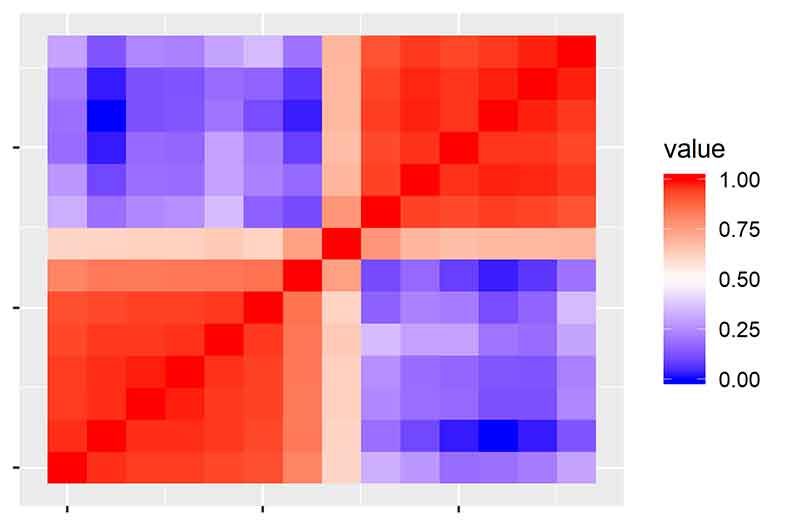
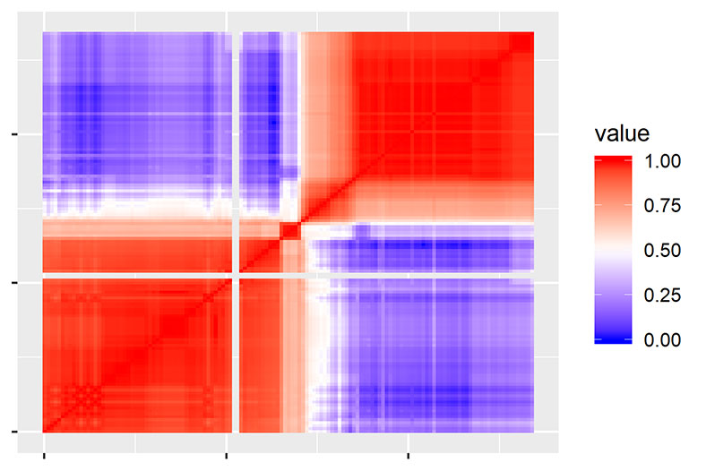
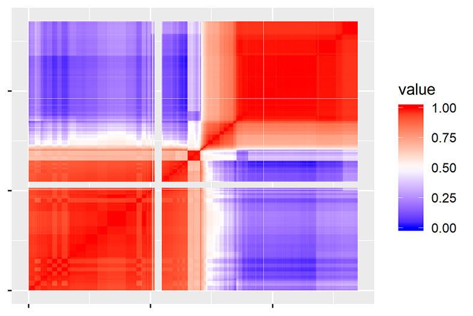

<style>
  .main-container {
    max-width: 1200px !important;
  }
</style>
<style type="text/css">
.main-container {
  max-width: 1200px;
  margin-left: auto;
  margin-right: auto;
}
</style>
---
title: "Creating Neuroblastoma Input Matrices from public GDC (TARGET) data"
author: "James Dalgleish"
date: "August 1, 2018"
output: rmarkdown::html_vignette
vignette: >
 %\VignetteEngine{knitr::rmarkdown}
 %\VignetteIndexEntry{Creating the TARGET Input matrix from public data}
 %\VignetteEncoding{UTF-8}
---
```{r setup, include=FALSE}
knitr::opts_chunk$set(echo = TRUE)

knitr::opts_knit$set(root.dir = '.')
library(CNVScope)
library(magrittr)
```
We have to begin our work by loading the library:
```{r,eval=F,echo=T}
library(CNVScope)
```
Following this, we'll obtain TARGET low-pass neuroblastoma data (NBL) from the GDC archive.
Please note: TARGET_NBL_WGS_CNVLOH.tsv is a clinical metadata file and therefore not compatible with the ensuing functions to extract segment data.
We have also chosen to use only a single comparison type (NormalVsPrimary) to ensure comparability and compatibility with the data. Users can download the tar.gz file and remove the tsv files into a single folder. We have already done that here.
The source for these files is located [here](https://portal.gdc.cancer.gov/legacy-archive/search/f?filters=%7B%22op%22:%22and%22,%22content%22:%5B%7B%22op%22:%22in%22,%22content%22:%7B%22field%22:%22files.data_category%22,%22value%22:%5B%22Copy%20number%20variation%22%5D%7D%7D,%7B%22op%22:%22in%22,%22content%22:%7B%22field%22:%22files.experimental_strategy%22,%22value%22:%5B%22WGS%22%5D%7D%7D,%7B%22op%22:%22in%22,%22content%22:%7B%22field%22:%22files.access%22,%22value%22:%5B%22open%22%5D%7D%7D,%7B%22op%22:%22in%22,%22content%22:%7B%22field%22:%22cases.project.project_id%22,%22value%22:%5B%22TARGET-NBL%22%5D%7D%7D%5D%7D&pagination=%7B%22files%22:%7B%22from%22:101,%22size%22:100,%22sort%22:%22cases.project.project_id:asc%22%7D%7D)


The user simply chooses to add all the files to the cart, then click the black cart button in the top right hand corner.


On the cart page, click download, then cart. It will be downloaded as a tar.gz archive.

You can untar it with R, but the files will be in a complex set of directories. It is best to list the files recursively
with criteria that will obtain the segment files in tsv format, with that single comparison of interest.
```{r nbl_files,eval=F,echo=T}
if(!dir.exists("extracted_nbl_data")){dir.create("extracted_nbl_data")}
untar("gdc_download_20180801_160142.tar.gz",exdir = "extracted_nbl_data")
target_files_nbl<-list.files(path = "extracted_nbl_data",pattern=glob2rx("*NormalVsPrimary.tsv"),recursive=T,full.names = T)
print(target_files_nbl)

```
With the full list of input files from the GDC, these can then be simply loaded into a function that will read all of them, sample match them, and aggregate the data into a bin-sample matrix. This matrix can then be saved into the fast, space efficient, RDS filetype.
```{r,eval=F,echo=T}
sample_aggregated_segvals_output_full<-formSampleMatrixFromRawGDCData(tcga_files = target_files_nbl,format = "TARGET")
saveRDS(sample_aggregated_segvals_output_full,"NBL_sample_matched_input_matrix.rds")

```

#Custom Data
For those who have a desire to add custom data, we have provided a series of options that allow
custom data, provided that a CSV file has a single column with copy number values.
We will show that the same result can be obtained with the correct options,
specifying the column of interest, using a completely different section of the function.
Use the format="custom" option and be sure to specify the names following columns in your text file:
*copy number column
*chromosome, 
*start position
*end position.
In this case, we have also selected freadskip=14 as there are 14 lines before the tabular data
begins. The sample pattern is a regular expression set to grab the sample name within the filename,
setting sample_pat="" will grab the complete filename and let this denote unique samples.
We suggest shorter sample than this, however.
A sample column name (sample_col) can also be specified
to specify samples on each line of the input files
instead of using the filename or a portion thereof. 

For further information, please review the help files by typing:
help("CNVScope::formSampleMatrixFromRawGDCData")

```{r, eval=F,echo=T}
nbl_custom_input_matrix<-formSampleMatrixFromRawGDCData(tcga_files = target_files_nbl,
format = "custom",binsize = 1e6,freadskip = 14,parallel=F,debug=F,
sample_pat = "(?<=30-)(.*?)(?=_)",sample_col = "sample",chrlabel=">chr",
startlabel = "begin",endlabel = "end",cnlabel = "relativeCvg")
saveRDS(nbl_custom_input_matrix,"NBL_custom_sample_matched_input_matrix.rds")

```

With this, your input matrix is complete.

Next, please look at the [next vignette that details recursive linear regression and postprocessing.](create_output_matrix.html)


Optional example for advanced Use: 
A high definition version is quite simple to do, using the above options,
on TARGET, TCGA, or custom format data. Simply decrease the binsize to increase the resolution.


In chromosome 2, we have found that the median bin size is 731069 and that smaller chromosomes
benefit from binsize reduction more than larger chromosomes (except for chromosome 1). 
In this case, we decrease our binsize by a factor of 4, making the total number of values 
in the matrix increase by a factor of 16. It will take longer than the typical time.
```{r, echo=T,eval=F}
nbl_custom_input_matrix_hd<-formSampleMatrixFromRawGDCData(tcga_files = target_files_nbl,
format = "custom",binsize = 2.5e5,freadskip = 14,parallel=T,debug=F,
sample_pat = "(?<=30-)(.*?)(?=_)",sample_col = "sample",chrlabel=">chr",
startlabel = "begin",endlabel = "end",cnlabel = "relativeCvg")
saveRDS(nbl_custom_input_matrix_hd,"NBL_custom_sample_matched_input_matrix_2.5e5binsize_parallel.rds")

```
In the opposite manner, if you wanted to quickly create a low density version,
this would be the way to go about it. It will make the input matrix creation process proceed a 
great deal faster and will require less RAM to display an interactive map.

```{r, echo=T,eval=F}
nbl_custom_input_matrix_ld<-formSampleMatrixFromRawGDCData(tcga_files = target_files_nbl,
format = "custom",binsize = 1e8,freadskip = 14,parallel=F,debug=F,
sample_pat = "(?<=30-)(.*?)(?=_)",sample_col = "sample",chrlabel=">chr",
startlabel = "begin",endlabel = "end",cnlabel = "relativeCvg")
saveRDS(nbl_custom_input_matrix,"NBL_custom_sample_matched_input_matrix_1e8binsize.rds")

```
A demonstration is below of varying resolutions, using correlation based maps (for space reasons):
Examples of chr11 are shown below, in increasing order of resolution (1e8,1e7,1e6,2.5e5,1e5 binsize).
Note that the resolution doesn't dramatically improve after 1e6, despite the time and
computational effort required to generate it.










A note on the resolution-performance/stability trade-off:
We would recommend not decreasing the bin size below the mean width of the region for which you 
hope to gain sharper images. Further, increasing higher resolution beyond what the program was
designed may result in instability.
We chose the 1MB bin size because, after many iterations, it creates maps that
enable visual appreciation of copy number regions,
but is reasonably responsive and stable for both client and server.
Higher dimension matrices were attempted in earlier versions of development, but would cause
browser crashes in larger chromosomal maps. Further, higher dimension maps limit usage on 
multi-user shiny servers. So, we still recommend the 1MB binsize for the aforementioned reasons.

