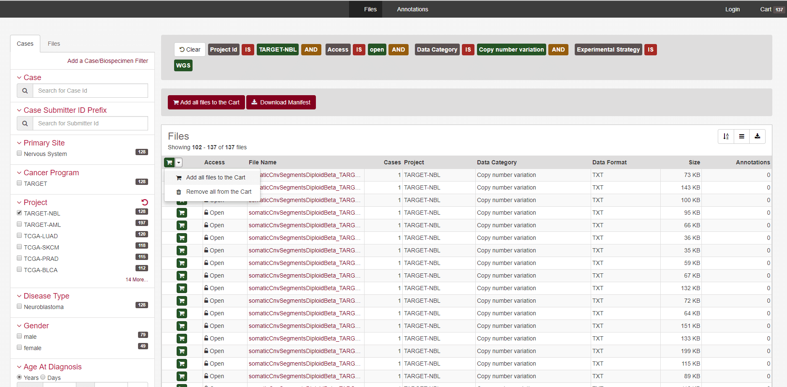

<style>
  .main-container {
    max-width: 1200px !important;
  }
</style>
<style type="text/css">
.main-container {
  max-width: 1200px;
  margin-left: auto;
  margin-right: auto;
}
</style>
---
title: "Creating Neuroblastoma Input Matrices from public GDC (TARGET) data"
author: "James Dalgleish"
date: "August 1, 2018"
output: rmarkdown::html_vignette
vignette: >
 %\VignetteEngine{knitr::rmarkdown}
 %\VignetteIndexEntry{Creating the TARGET Input matrix from public data}
 %\VignetteEncoding{UTF-8}
---
```{r setup, include=FALSE}
knitr::opts_chunk$set(echo = TRUE)

knitr::opts_knit$set(root.dir = '.')
library(CNVScope)
```
We have to begin our work by loading the library:
```{r,eval=F,echo=T}
library(CNVScope)
```
Following this, we'll obtain TARGET low-pass neuroblastoma data (NBL) from the GDC archive.
Please note: TARGET_NBL_WGS_CNVLOH.tsv is a clinical metadata file and therefore not compatible with the ensuing functions to extract segment data.
We have also chosen to use only a single comparison type (NormalVsPrimary) to ensure comparability and compatibility with the data. Users can download the tar.gz file and remove the tsv files into a single folder. We have already done that here.
The source for these files is located [here](https://portal.gdc.cancer.gov/legacy-archive/search/f?filters=%7B%22op%22:%22and%22,%22content%22:%5B%7B%22op%22:%22in%22,%22content%22:%7B%22field%22:%22files.data_category%22,%22value%22:%5B%22Copy%20number%20variation%22%5D%7D%7D,%7B%22op%22:%22in%22,%22content%22:%7B%22field%22:%22files.experimental_strategy%22,%22value%22:%5B%22WGS%22%5D%7D%7D,%7B%22op%22:%22in%22,%22content%22:%7B%22field%22:%22files.access%22,%22value%22:%5B%22open%22%5D%7D%7D,%7B%22op%22:%22in%22,%22content%22:%7B%22field%22:%22cases.project.project_id%22,%22value%22:%5B%22TARGET-NBL%22%5D%7D%7D%5D%7D&pagination=%7B%22files%22:%7B%22from%22:101,%22size%22:100,%22sort%22:%22cases.project.project_id:asc%22%7D%7D)


The user simply chooses to add all the files to the cart, then click the black cart button in the top right hand corner.


On the cart page, click download, then cart. It will be downloaded as a tar.gz archive.

You can untar it with R, but the files will be in a complex set of directories. It is best to list the files recursively
with criteria that will obtain the segment files in tsv format, with that single comparison of interest.
```{r nbl_files,eval=F,echo=T}
if(!dir.exists("extracted_nbl_data")){dir.create("extracted_nbl_data")}
untar("gdc_download_20180801_160142.tar.gz",exdir = "extracted_nbl_data")
target_files_nbl<-list.files(path = "extracted_nbl_data",pattern=glob2rx("*NormalVsPrimary.tsv"),recursive=T,full.names = T)
print(target_files_nbl)

```
With the full list of input files from the GDC, these can then be simply loaded into a function that will read all of them, sample match them, and aggregate the data into a bin-sample matrix. This matrix can then be saved into the fast, space efficient, RDS filetype.
```{r,eval=F,echo=T}
sample_aggregated_segvals_output_full<-formSampleMatrixFromRawGDCData(tcga_files = target_files_nbl,format = "TARGET")
saveRDS(sample_aggregated_segvals_output_full,"NBL_sample_matched_input_matrix.rds")

```

With this, your input matrix is complete. Next, please look at the [vignette that details recursive linear regression and postprocessing](https://cran.r-project.org/web/packages/CNVScope/vignettes/create_output_matrix.html).

Additional examples:
[TCGA-BLCA](https://portal.gdc.cancer.gov/legacy-archive/search/f?filters=%7B%22op%22:%22and%22,%22content%22:%5B%7B%22op%22:%22in%22,%22content%22:%7B%22field%22:%22files.data_category%22,%22value%22:%5B%22Copy%20number%20variation%22%5D%7D%7D,%7B%22op%22:%22in%22,%22content%22:%7B%22field%22:%22files.experimental_strategy%22,%22value%22:%5B%22WGS%22%5D%7D%7D,%7B%22op%22:%22in%22,%22content%22:%7B%22field%22:%22files.access%22,%22value%22:%5B%22open%22%5D%7D%7D,%7B%22op%22:%22in%22,%22content%22:%7B%22field%22:%22cases.project.project_id%22,%22value%22:%5B%22TCGA-BLCA%22%5D%7D%7D%5D%7D&pagination=%7B%22files%22:%7B%22from%22:0,%22size%22:100,%22sort%22:%22cases.project.project_id:asc%22%7D%7D)
[TARGET-AML](https://portal.gdc.cancer.gov/legacy-archive/search/f?filters=%7B%22op%22:%22and%22,%22content%22:%5B%7B%22op%22:%22in%22,%22content%22:%7B%22field%22:%22files.data_category%22,%22value%22:%5B%22Copy%20number%20variation%22%5D%7D%7D,%7B%22op%22:%22in%22,%22content%22:%7B%22field%22:%22files.experimental_strategy%22,%22value%22:%5B%22WGS%22%5D%7D%7D,%7B%22op%22:%22in%22,%22content%22:%7B%22field%22:%22files.access%22,%22value%22:%5B%22open%22%5D%7D%7D,%7B%22op%22:%22in%22,%22content%22:%7B%22field%22:%22cases.project.project_id%22,%22value%22:%5B%22TARGET-AML%22%5D%7D%7D%5D%7D&pagination=%7B%22files%22:%7B%22from%22:0,%22size%22:100,%22sort%22:%22cases.project.project_id:asc%22%7D%7D)
[TARGET-SKCM](https://portal.gdc.cancer.gov/legacy-archive/search/f?filters=%7B%22op%22:%22and%22,%22content%22:%5B%7B%22op%22:%22in%22,%22content%22:%7B%22field%22:%22files.data_category%22,%22value%22:%5B%22Copy%20number%20variation%22%5D%7D%7D,%7B%22op%22:%22in%22,%22content%22:%7B%22field%22:%22files.experimental_strategy%22,%22value%22:%5B%22WGS%22%5D%7D%7D,%7B%22op%22:%22in%22,%22content%22:%7B%22field%22:%22files.access%22,%22value%22:%5B%22open%22%5D%7D%7D,%7B%22op%22:%22in%22,%22content%22:%7B%22field%22:%22cases.project.project_id%22,%22value%22:%5B%22TCGA-SKCM%22%5D%7D%7D%5D%7D&pagination=%7B%22files%22:%7B%22from%22:0,%22size%22:100,%22sort%22:%22cases.project.project_id:asc%22%7D%7D)

There are fewer TARGET datasets available than TCGA. We'll do AML first. We've named our downloaded archive gdc_download_aml.tar.gz.

```{r aml_files,eval=F,echo=T}
if(!dir.exists("extracted_aml_data")){dir.create("extracted_aml_data")}
untar("gdc_download_aml.tar.gz",exdir = "./extracted_aml_data")
target_files_aml<-list.files(path = "extracted_aml_data",pattern=glob2rx("*NormalVsPrimary.tsv"),recursive=T,full.names = T)
print(target_files_aml)
```

```{r,eval=F,echo=T}
sample_aggregated_segvals_aml<-formSampleMatrixFromRawGDCData(tcga_files = target_files_aml,format = "TARGET")
saveRDS(sample_aggregated_segvals_aml,"aml_sample_matched_input_matrix.rds")
```

Now that we've created and saved the AML matrix, let's visualize it with a quick correlation map of a single chromosome, chromosome 13, the location of the FLT3 gene. The FLT3 gene is a locus for recurrent copy number aberrations(reference: http://www.bloodjournal.org/content/130/Suppl_1/3800?sso-checked=true).
```{r aml_plots, eval=F,echo=T}
cor(t(sample_aggregated_segvals_aml))  %>% 
  CNVScope::signedRescale(max_cap=75) %>%
  reshape2::melt()  %>%
  ggplot(aes(x=Var1,y=Var2,fill=value)) + geom_raster() +
  theme(axis.text.x = element_blank(),axis.text.y=element_blank()) +
  ggplot2::scale_fill_gradient2(low = "blue", high = "red", midpoint = 0.5, limits = c(0, 1))
```

Now for a TCGA set, let's try a bladder cancer dataset:
```{r aml_files,eval=F,echo=T}
if(!dir.exists("extracted_blca_data")){dir.create("extracted_blca_data")}
untar("gdc_download_blca.tar.gz",exdir = "./extracted_blca_data")
target_files_aml<-list.files(path = "extracted_blca_data",pattern=glob2rx("*.tsv"),recursive=T,full.names = T)
print(target_files_aml)
```
